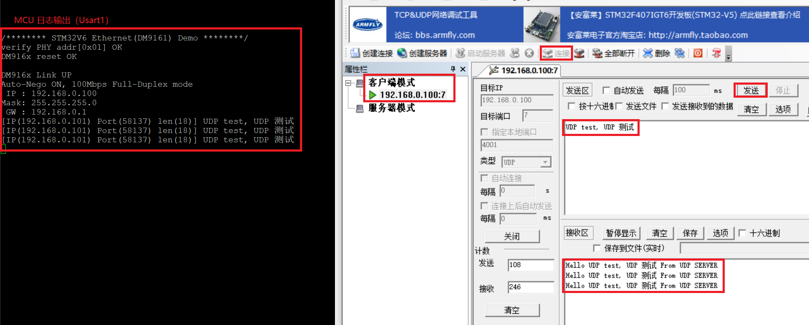
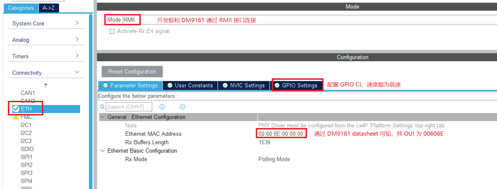
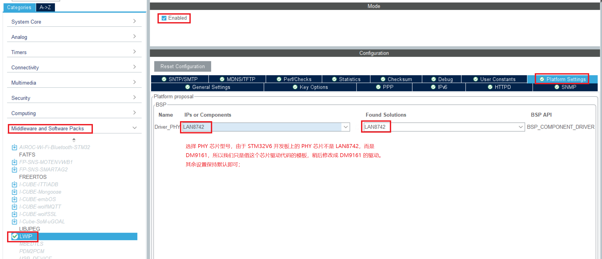
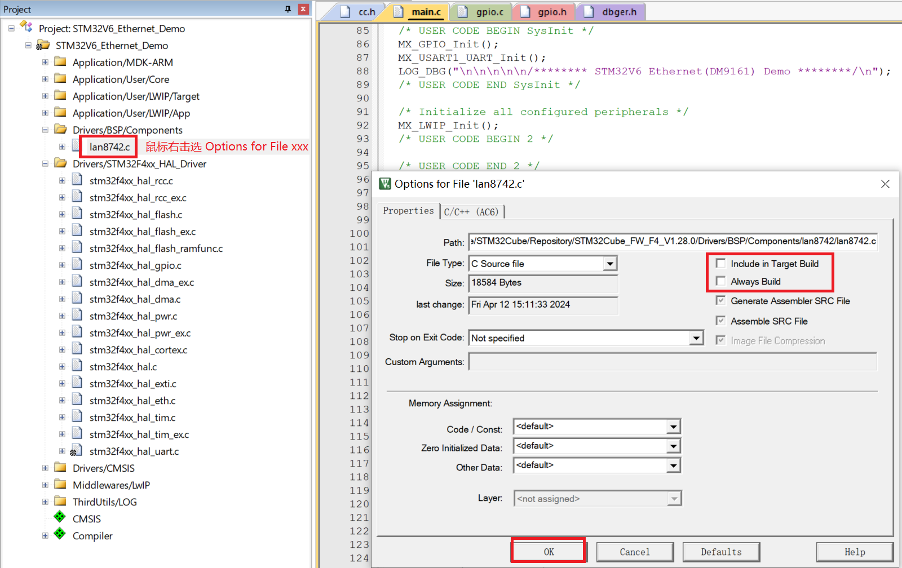

## UDP server
1. 服务器一般都是固定`IP`地址的，所以本例程在`cubeMx`中配置了静态`IP`；
2. 在`udpServer_init()`中，初始化了`UDP`服务器的`IP`以及端口(`7`)；
3. 只需要通过[`TCPUDPDbg.exe`](./TCPUDPDbg.7z)工具创建一个`UDP`客户端，并通过`IP`和端口连接到本例程服务器，就可以实现数据的收发了：


## 注意
1. 在下面的`工程创建过程-第3步`中，选择了`LAN8742`作为`PHY`芯片驱动代码模板，熟悉后完全可以不选，直接在生成的代码中编辑`ethernetif.c`文件即可(也不需要复制重命名了)；
2. 在`cubeMx`的`LWIP`配置里面开启`Debug`后好像并没有日志输出，需要手动在工程代码的`lwipopts.h`中加上如下代码（按需使能）：
```c
  #define LWIP_DEBUG 1
  #define NETIF_DEBUG LWIP_DBG_ON
  #define DHCP_DEBUG LWIP_DBG_ON
  #define UDP_DEBUG  LWIP_DBG_ON
  //#define MEMP_DEBUG LWIP_DBG_ON
  //#define MEM_DEBUG LWIP_DBG_ON
  #define ICMP_DEBUG LWIP_DBG_ON
```

## 说明
1. 本工程基于安富莱`STM32V6`开发板，通过`cubeMx`进行工程配置；
2. 工程使用`DHCP`协议动态从路由器获取`IP`地址，所以开发板的`IP`地址需要从路由器后台获取;
3. 工程编译下载后，开发板的`CN4`通过网线和路由器连接；
4. 当电脑和开发板处于同一子网时，可以通过电脑终端通过`ping ipv4_addr`指令验证本工程；
5. 当前`LwIP`版本支持热拔插，断点自动重连等功能；

## 工程创建过程
1. 打开`cubeMx`，选择`stm32f429bi`，配置主频`168MHz(crystal=8MHz)`，并使能调试端口；
2. 使能`Connectivity -> ETH`:

3. 使能`Middleware and Software Packs -> LWIP`：

4. 由于工程是通过串口输出日志的，所以还需要使能`usart1`;
5. 配置工程名及路径等其他信息(注意：`cubeMx`生成的初始化代码顺序是可以调节的)，并生成代码；

6. 编译工程，发现以下错误：
> 1. `STM32Cube_FW_F4_V1.28.0/Middlewares/Third_Party/LwIP/system\arch/cc.h(47): error: 'sys/time.h' file not found`  
    这错误是由于`cc.h`中包含了`sys/time.h`头文件引起的。可能是之前的`ARM Compiler V5`编译器有这个头文件，但是我使用的`ARM Compiler V6`没有了，导致报错，   
    直接按如下方式修改即可([参考](https://github.com/STMicroelectronics/STM32CubeF4/issues/29))：  
```c
    // cc.h line 43
    // #if defined (__GNUC__) & !defined (__CC_ARM)
    #if defined (__GNUC__) && !defined (__CC_ARM) && !(defined(__ARMCC_VERSION) && (__ARMCC_VERSION >= 6010050))
```

> 2. 我们注意到`cc.h`文件中，还有如下日志输出语句，其使用了`printf()`函数，没有重定向输出，需要改为自己的调试接口；   
```c
    #define LWIP_PLATFORM_ASSERT(x) do {printf("Assertion \"%s\" failed at line %d in %s\n", \
                                     x, __LINE__, __FILE__); } while(0)
```

> 3. `Error: L6218E: Undefined symbol sio_open (referred from slipif.o)`等相似报错    
    这个是因为在`slipif.c`文件中调用了未定义的`sio_open()`等函数引起的；直接在`keil -> Middlewares/LwIP -> slipif.c -> 右击 -> Options for File 'slipif.c' -> 去掉 'Include in Target Build' 和 'Always Build' 前面的勾 -> OK`即可；    
    

7. 导入日志模块（如果你有自己的日志模块，这一步可以导入你自己的日志模块），然后将日志模块的路径及文件添加到工程（日志模块使用了`MDK-ARM`的`RTE`标准输出重定向功能，所以需要在`MDK-ARM -> RTE -> Compiler -> I/O -> STDOUT(user)`使能）：
```
    git submodule add https://github.com/ShadowThree/dbger.git ThirdUtils/dbger
```
8. 到目前为止，工程应该能够正常编译了，可以在串口初始化之后添加一下日志看看是否正常输出：
```c
  /* USER CODE BEGIN SysInit */
	MX_GPIO_Init();         // 这两个函数在 cubeMx 中配置了不产生函数调用，所以需要用户主动调用
	MX_USART1_UART_Init();
	LOG_DBG("\n\n\n\n\n/******** STM32V6 Ethernet(DM9161) Demo ********/\n");
  /* USER CODE END SysInit */
```
9. 由于生成的工程默认使用的`PHY`芯片是`LAN8742`，而开发板上的是`DM9161`，所以还有一些开发工作需要做。
10. 首先将`lan8742.c`文件从工程中移除：

11. 然后编译，发现如下三条未定义错误，说明工程中调用了`lan8742.c`文件中的以下三个文件，而且都是在`ethernetif.c`中调用的；
```txt
    Error: L6218E: Undefined symbol LAN8742_RegisterBusIO (referred from ethernetif.o).
    Error: L6218E: Undefined symbol LAN8742_Init (referred from ethernetif.o).
    Error: L6218E: Undefined symbol LAN8742_GetLinkState (referred from ethernetif.o).
```
12. 现在一切都很清晰了：我们需要实现`DM9161`芯片的以上三个函数功能，并且在`ethernetif.c`中调用他们；具体代码详见工程源码；由于`cubeMx`每次重新生成代码时，都会覆盖`ethernetif.c`文件，所以这里将生成的`ethernetif.c`文件从工程中去掉，再将其复制并重命名到其他路径下([`eg: ethernetif_DM916x.c`](./ThirdUtils/PHY_DM916x/ethernetif_DM916x.c))，最后添加到工程即可；
13. 在`main()`的主循环中处理网络事件:
```c
  while (1)
  {
	  MX_LWIP_Process();
  }
```
14. 编译工程并下载，将开发板的`CN4`通过网线连接到路由器；并将一台电脑通过网线或者`wifi`连接到相同路由器的网络；
15. 在路由器中查看开发板的`IP`地址；
16. 在电脑的终端中输入指令：`ping ip_addr`检查其连通性；不出意外的话，应该是可以正常工作了。
